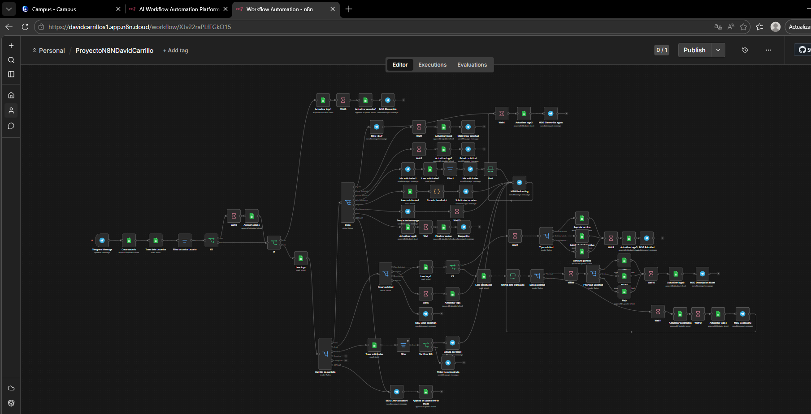

# HelpDeskBot – Asistente Automatizado de Soporte Interno 🤖

  
  
  

---

## 📝 Descripción
**HelpDeskBot** es un bot conversacional diseñado para gestionar solicitudes internas de soporte (incidentes técnicos, administrativos y consultas generales). A diferencia de los bots de IA abierta, este opera bajo **flujos conversacionales controlados**, garantizando orden, persistencia de datos y una experiencia de usuario humanizada pero predecible.

> [!IMPORTANT]
> El bot no toma decisiones autónomas; guía al usuario mediante opciones numéricas y registra cada interacción para una trazabilidad completa.

---

## 🛠️ Arquitectura Técnica
El proyecto se apoya en tres pilares fundamentales:

1.  **Interfaz:** Telegram Bot API.
2.  **Lógica y Orquestación:** n8n (Community Edition).
3.  **Persistencia:** Google Sheets (Documento: `HelpDeskBot_DB`).

### Modelo de Datos
El sistema utiliza tres tablas principales en Google Sheets:
* **`SOLICITUDES`**: Control de tickets (id, tipo, prioridad, descripción, estado, etc.).
* **`USUARIOS`**: Gestión de acceso y roles (ID de Telegram, nombre, activo/inactivo).
* **`LOGS`**: Auditoría en tiempo real de la navegación del usuario.

---

## 🚀 Experiencia Conversacional
El bot utiliza un sistema de navegación por números para facilitar la interacción.

### Flujo Principal
Cuando un usuario inicia contacto, es recibido por el **Menú Principal**:
1. Ayuda
2. Crear solicitud
3. Consultar estado de solicitud
4. Mis solicitudes
5. Reportes
6. Configuración

### Proceso de Registro (Wizard)
Al crear una solicitud, el bot guía al usuario paso a paso:
1. **Tipo:** Técnico, Administrativo o General.
2. **Prioridad:** Selección entre Alta, Media o Baja.
3. **Descripción:** Entrada de texto libre.
4. **Confirmación:** Validación final antes de insertar en la base de datos.

---

## ⚙️ Automatizaciones Obligatorias
El flujo en **n8n** ejecuta las siguientes acciones críticas:
- [x] **Registro Automático:** Inserción inmediata del ticket tras la confirmación.
- [x] **Gestión de Estados:** Ciclo de vida del ticket (Abierto → En proceso → Cerrado).
- [x] **Notificaciones:** Alerta automática vía Telegram/Correo al crear o actualizar.
- [x] **Auditoría:** Cada paso por las "pantallas" del bot se registra en la hoja de `LOGS`.

---

## ✅ Validaciones del Sistema
Para asegurar la integridad de la información, el bot valida:
* **Usuario Activo:** Solo usuarios registrados en la tabla `USUARIOS` pueden interactuar.
* **Campos Obligatorios:** No se permiten saltar pasos en el registro del ticket.
* **Confirmación:** Paso obligatorio de "Aceptar/Cancelar" antes de escribir en Sheets.

---

## 📦 Instalación (Requisitos)
1. Clonar el flujo de n8n (archivo JSON adjunto).
2. Crear un Bot en Telegram vía `@BotFather`.
3. Configurar las credenciales de **Google Sheets** y conectar el ID del documento `HelpDeskBot_DB`.
4. Configurar el Webhook en n8n para recibir mensajes de Telegram.

---

  

